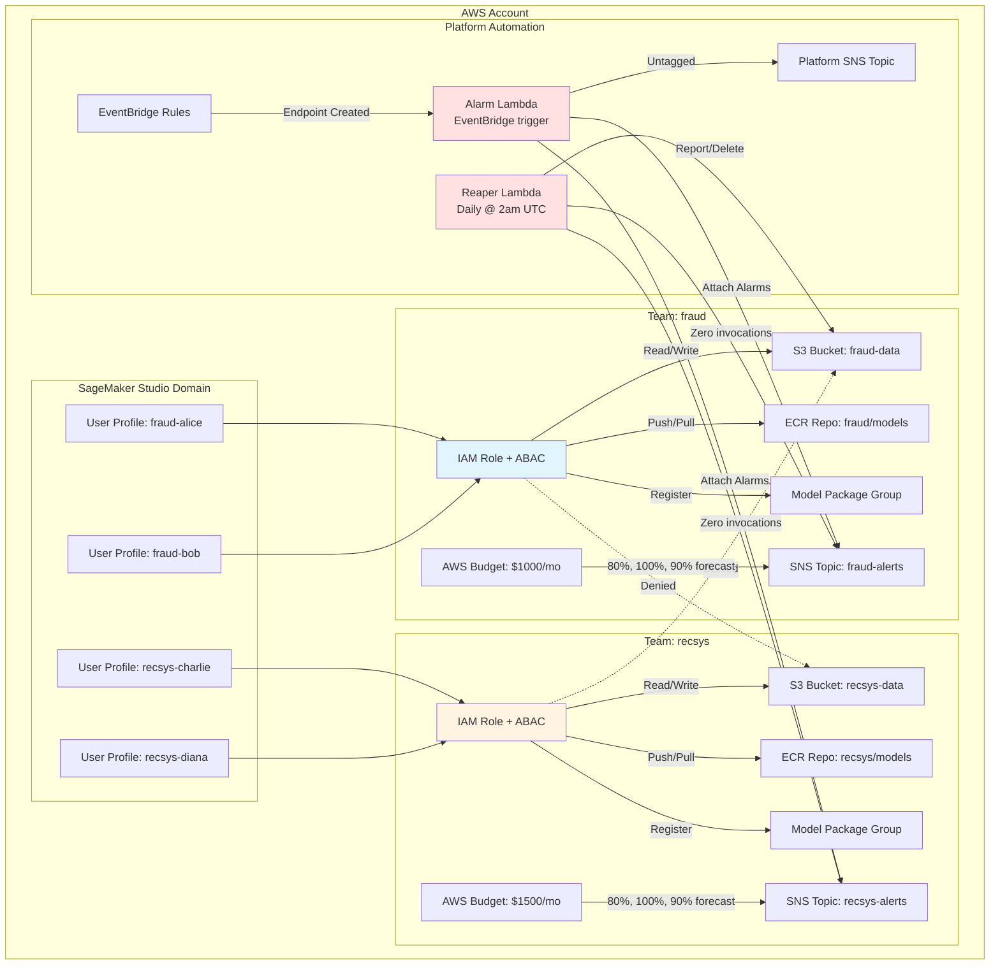

# SageMaker Multi-Team Platform Starter

[](https://github.com/saranreddy/sagemaker-multi-team-platform-starter/actions/workflows/ci.yml)
[](https://www.terraform.io/)
[](https://registry.terraform.io/providers/hashicorp/aws/latest)

Download-and-apply AWS starter: onboard a whole data science team to Amazon SageMaker with **ONE Terraform entry**, with per-team cost guardrails and default monitoring built in.

Stop hand-building setups. Stop being paged for every team's models.

## Who This Is For

### Use this starter when:

- **Your ML org just scaled fast** (merger, acquisition, rapid hiring) and you need to onboard many data scientists quickly
- **You have many small to medium DS teams** sharing one AWS account and need cost visibility and isolation per team
- **You're a platform engineer** supporting multiple teams but don't want to hand-configure SageMaker Studio, S3, ECR, model registry, and monitoring for each team
- **You need honest cost controls** — idle resource detection, budgets with real alerts, and near-zero cost when no workloads are running

### Concrete use cases:

- **Post-merger onboarding**: 3 → 50 data scientists overnight, 2 MLOps engineers, one account
- **Multi-team ML platform**: fraud, recommendations, forecasting, and NLP teams each need isolated resources
- **Cost transparency**: finance wants per-team budget tracking without giving each team a separate AWS account

### Do NOT use this starter if:

- **You have a single small team** (< 5 people) — overkill, just use the console or a simple module
- **You're already on AWS Control Tower** with account-per-team landing zones — this is for shared-account scenarios
- **You're on Databricks, Vertex AI, or another ML platform** — this is SageMaker-specific
- **You need multi-account isolation** for compliance or security — use AWS Organizations and separate accounts instead

---

## Architecture



**Key components:**

1. **Shared Studio domain** with VPC isolation, per-team user profiles
2. **Team module** (reusable) creates S3 bucket, ECR repo, model registry, IAM role with ABAC, SNS topic, and Budget
3. **Isolation enforced** via team tags and IAM conditions (`aws:PrincipalTag`, `aws:ResourceTag`, `sagemaker:InstanceTypes`)
4. **Reaper Lambda** scans for idle endpoints and Studio apps; reports or deletes based on configuration
5. **Alarm Lambda** auto-attaches CloudWatch alarms (5XX, latency, invocation drop) to new endpoints, routes to team's SNS topic

---

## Onboarding Flow (3 Steps)

### 1. Add a team to `terraform.tfvars`

```hcl
teams = {
  fraud = {
    members = ["alice", "bob"]
    email_alerts = ["fraud-team@example.com"]
    monthly_budget_usd = 1000
    allowed_instance_types = [
      "ml.t3.medium",
      "ml.m5.xlarge",
      "ml.m5.2xlarge"
    ]
  }
  
  # Add new team here ↓
  forecasting = {
    members = ["eve", "frank"]
    email_alerts = ["forecasting@example.com"]
    monthly_budget_usd = 2000
    allowed_instance_types = [
      "ml.t3.medium",
      "ml.m5.2xlarge",
      "ml.c5.4xlarge"
    ]
  }
}
```

**Helper command:**

```bash
make add-team NAME=forecasting
```

### 2. Apply Terraform

```bash
make apply
```

Creates in ~3-5 minutes:
- Studio user profiles for `forecasting-eve` and `forecasting-frank`
- S3 bucket `sagemaker-platform-forecasting-data-<account-id>`
- ECR repo `sagemaker-platform/forecasting/models`
- Model package group `sagemaker-platform-forecasting-registry`
- IAM execution role with team tag `Team=forecasting`
- SNS topic for team alerts
- AWS Budget ($2000/month) filtered by `Team$forecasting` cost allocation tag

### 3. Give users the Studio URL

```bash
terraform output studio_domain_url
```

Team members sign in via IAM, select their profile (`forecasting-eve`), and start notebooks/training with the team's execution role automatically applied.

---

## Cost Table

| Resource | Idle Cost | Active Cost | Notes |
|----------|-----------|-------------|-------|
| **SageMaker Studio domain** | $0 | $0 | Domain itself is free |
| **Studio EFS storage** | ~$0.30/GB-month | ~$0.30/GB-month | [EFS pricing](https://aws.amazon.com/efs/pricing/) — charged per GB stored |
| **Studio notebooks/apps** | $0 | Instance pricing | [SageMaker Studio pricing](https://aws.amazon.com/sagemaker/pricing/) — `ml.t3.medium` ~$0.05/hr, only when running |
| **S3 buckets** | ~$0.023/GB-month | ~$0.023/GB-month | [S3 Standard pricing](https://aws.amazon.com/s3/pricing/) — pay for storage used |
| **ECR repositories** | ~$0.10/GB-month (approx) | ~$0.10/GB-month (approx) | [ECR pricing](https://aws.amazon.com/ecr/pricing/) — 0.5 GB free, then $0.10/GB-month |
| **Model Package Groups** | $0 | $0 | Metadata only, no charge |
| **Lambda (reaper + alarm)** | ~$0.00 | ~$0.00 | [Lambda free tier](https://aws.amazon.com/lambda/pricing/): 1M requests free/month |
| **EventBridge rules** | ~$0.00 | ~$0.00 | [EventBridge pricing](https://aws.amazon.com/eventbridge/pricing/): custom events ~$1/million |
| **AWS Budgets** | $0.02/budget-month | $0.02/budget-month | [Budgets pricing](https://aws.amazon.com/aws-cost-management/aws-budgets/pricing/): first 2 free, $0.02 each after |
| **SNS topics** | $0 | ~$0.00-$2.00 | [SNS pricing](https://aws.amazon.com/sns/pricing/): $0.50/million publishes, email notifications free |
| **SageMaker endpoints** | Not created | Instance + hosting pricing | [SageMaker endpoint pricing](https://aws.amazon.com/sagemaker/pricing/) — billed per instance-hour |

**Summary:**
- **Idle cost (zero workloads)**: Near $0 — only small EFS storage (~few cents if user homes are empty) and Budgets ($0.02/team if > 2 teams)
- **Active cost**: Pay only for compute you use (notebooks, training jobs, endpoints)
- **Example**: 2 teams, 10 GB EFS (approx), 5 GB ECR images (approx) = ~$3.50/month idle

**Important:** Cost allocation tags (for Budgets) must be [activated in AWS Billing Console](https://docs.aws.amazon.com/awsaccountbilling/latest/aboutv2/activating-tags.html) and can take up to 24 hours to appear.

---

## Installation

### Prerequisites

```bash
# Check prerequisites
make doctor
```

Required:
- **Terraform** >= 1.5.7
- **AWS CLI** configured with credentials (`aws sts get-caller-identity` works)
- **Python 3** (for Lambda testing)

Optional but recommended:
- **tflint** (for `make lint`)
- **pytest** (for `make test`)

### Quick Start

```bash
# 1. Clone and configure
git clone https://github.com/saranreddy/sagemaker-multi-team-platform-starter.git
cd sagemaker-multi-team-platform-starter
cp terraform.tfvars.example terraform.tfvars

# 2. Edit terraform.tfvars with your teams and email addresses

# 3. Initialize and apply
make init
make plan
make apply

# 4. (Optional) Run smoke tests
make smoke

# 5. Get Studio URL
terraform output studio_domain_url
```

---

## Configuration

### Variables

| Variable | Default | Description |
|----------|---------|-------------|
| `aws_region` | `us-east-1` | AWS region |
| `environment` | `dev` | Environment name |
| `project_name` | `sagemaker-platform` | Prefix for all resources |
| `vpc_id` | (auto-detected) | VPC ID for Studio domain; defaults to default VPC |
| `subnet_ids` | (auto-detected) | Subnet IDs for Studio domain; defaults to all default VPC subnets |
| `teams` | (required) | Map of teams with members, budgets, instance types |
| `reaper_enabled` | `false` | If `true`, reaper **deletes** idle resources; if `false`, only reports |
| `reaper_endpoint_idle_days` | `7` | Days with zero invocations before endpoint is idle |
| `reaper_studio_app_idle_hours` | `24` | Hours idle before Studio app is flagged |
| `enable_smoke_test_assume` | `true` | Allow deploying principal to assume team roles (disable in prod) |
| `platform_alert_emails` | `[]` | Emails for platform alerts (untagged resources, errors) |

### Teams Structure

```hcl
teams = {
  <team-name> = {
    members                = list(string)      # Required: usernames for Studio profiles
    email_alerts           = list(string)      # Optional: email addresses for SNS alerts
    monthly_budget_usd     = number           # Optional: default 1000
    allowed_instance_types = list(string)      # Optional: default includes ml.t3/m5/c5 medium-2xlarge
  }
}
```

### Remote State (Optional)

For team usage, configure S3 backend:

```hcl
# backend.tf
terraform {
  backend "s3" {
    bucket         = "my-terraform-state-bucket"
    key            = "sagemaker-platform/terraform.tfstate"
    region         = "us-east-1"
    encrypt        = true
    dynamodb_table = "terraform-locks"
  }
}
```

See [saranreddy/aws-terraform-remote-state-starter](https://github.com/saranreddy/aws-terraform-remote-state-starter) for S3 backend setup.

---

## Usage

### Adding a New Team

```bash
# Option 1: Use helper
make add-team NAME=newteam

# Option 2: Edit terraform.tfvars manually, then
make apply
```

### Running Smoke Tests

Validates infrastructure and isolation:

```bash
make smoke
```

**What it tests:**
- ✓ Studio domain exists
- ✓ Each team's S3 bucket, ECR repo, model registry, SNS, budget exist
- ✓ Team A can read/write its own S3 bucket
- ✓ Team A **cannot** access Team B's S3 bucket (isolation)
- ✓ Reaper Lambda invokes successfully
- ✓ Alarm Lambda exists and is wired to EventBridge

**Note:** Isolation test requires `enable_smoke_test_assume = true` (default). **For root account callers**, the smoke test automatically creates a temporary IAM user with minimal permissions to perform the assume-role tests, then cleans up the user afterward. For production deployments, it's recommended to use a non-root IAM user or role for deployment and testing.

### Enabling the Reaper (Deletion Mode)

By default, the reaper Lambda is in **report-only** mode:

```hcl
# terraform.tfvars
reaper_enabled = false  # Reports findings to team SNS topics
```

To enable deletion:

```hcl
reaper_enabled = true   # Deletes idle endpoints and Studio apps
```

Then `make apply`.

**Reaper behavior:**
- Runs daily at 2 AM UTC (customizable in `modules/reaper-lambda/main.tf`)
- Finds endpoints with zero invocations over `reaper_endpoint_idle_days` (default 7)
- Finds Studio apps idle beyond `reaper_studio_app_idle_hours` (default 24)
- Sends findings to owning team's SNS topic (or platform topic if untagged)
- If `reaper_enabled = true`, deletes endpoints and their configs, deletes idle apps

### Manual Lambda Testing

```bash
# Invoke reaper manually
aws lambda invoke \
  --function-name sagemaker-platform-idle-resource-reaper \
  --region us-east-1 \
  --payload '{}' \
  /tmp/reaper-output.json

cat /tmp/reaper-output.json
```

---

## Monitoring

### Default Alarms

When any endpoint is created or updated (EventBridge detects `SageMaker Endpoint State Change` → `InService`), the alarm Lambda automatically attaches:

1. **5XX Errors**: Triggers if any model invocation 5XX errors occur within 5 minutes
2. **High Latency (p90)**: Triggers if p90 latency exceeds 10 seconds for 2 consecutive 5-minute periods
3. **Invocation Drop**: Triggers if invocations drop below 1/hour (useful for detecting broken traffic)

All alarms route to the **team's SNS topic** (extracted from endpoint's `Team` tag).

**Untagged endpoints** trigger a warning to the platform SNS topic.

### Data Quality Monitoring

For data/model quality drift detection, see:
- [saranreddy/sagemaker-model-monitor-starter](https://github.com/saranreddy/sagemaker-model-monitor-starter)

This starter provides baseline capture, drift schedules, and alert integration. Deploy it separately and point it at your endpoints.

---

## Teardown

### Destroy Infrastructure

```bash
make destroy
```

**What happens:**
1. `scripts/pre-destroy.sh` runs: deletes CloudWatch alarms created by the alarm Lambda, then deletes all Studio apps and spaces (they block domain deletion)
2. Waits for apps to finish deleting (~2-5 minutes)
3. Terraform destroys domain, profiles, team resources, Lambdas, EventBridge rules
4. S3 buckets, ECR repos, and Budgets are deleted (EFS set to `Delete` retention)

**Important:** S3 bucket deletion will fail if buckets contain objects. Either:
- Manually empty buckets before destroying, OR
- Add `force_destroy = true` to `aws_s3_bucket` in `modules/team/main.tf` (not recommended for production)

---

## Testing

### Unit Tests (Lambda Functions)

```bash
make test
```

Runs `pytest` on:
- `tests/test_reaper.py` — reaper Lambda logic (finding idle resources, deletion, notifications)
- `tests/test_endpoint_alarm.py` — alarm attachment logic (team extraction, alarm creation, EventBridge handling)

All tests use mocked boto3 clients (no AWS API calls).

### CI Pipeline

`.github/workflows/ci.yml` runs on every push:
- ✓ `terraform fmt -check`
- ✓ `terraform validate`
- ✓ `tflint`
- ✓ `pytest`
- ✓ `terraform plan` (only if `AWS_ACCESS_KEY_ID` secret is set)

---

## Known Limitations

1. **Studio domain destroy order**: Studio apps and spaces must be deleted before user profiles and domain. The `pre-destroy.sh` script handles this automatically, but if it fails or is skipped, destroy will hang. Manually delete apps and spaces via console or CLI if needed.

2. **Cost allocation tags take 24h**: AWS Budgets filtered by `Team` tag won't work until the tag is activated in Billing Console and propagates (up to 24 hours).

3. **Budget notifications require SNS subscription confirmation**: Email subscribers must confirm SNS subscription before receiving budget alerts.

4. **No cross-team collaboration**: This starter enforces hard isolation. If teams need to share datasets or models, you'll need to add cross-team IAM policies or S3 bucket policies manually.

5. **Reaper Lambda is scheduled, not real-time**: Idle resources are cleaned up daily at 2 AM UTC. For faster cleanup, change the EventBridge schedule in `modules/reaper-lambda/main.tf`.

6. **Smoke test assume-role**: Isolation tests require deploying principal to assume team roles. Disable `enable_smoke_test_assume` in production or provide a dedicated test IAM user. For root account callers, the smoke test automatically creates a temporary IAM user for testing (cleaned up after). The trust policy allows the deploying principal and temporary smoke test users (named `sagemaker-smoke-test-*`). For SSO/assumed-role callers, note that `aws_caller_identity` returns the session ARN; you may need to normalize it or use an explicit variable.

7. **Default VPC dependency**: By default, the starter uses your account's default VPC. If you've deleted it, provide explicit `vpc_id` and `subnet_ids`.

8. **Terraform state contains sensitive data**: Use a remote S3 backend with encryption and access controls. Local state is only for testing.

9. **SageMaker Projects not included**: This starter does not configure SageMaker Projects (MLOps templates). Add `aws_sagemaker_project` resources if needed.

10. **Multi-region not supported**: All resources are in one region (`var.aws_region`). For multi-region, duplicate the root module per region.

11. **Domain security group and EFS ENIs**: After Terraform destroy, the domain security group and EFS ENIs may take a few minutes to be removed by AWS. This is normal and does not affect cleanup.

12. **Reaper doesn't delete new endpoints**: Endpoints younger than the idle window (7 days by default) are skipped even if they have zero invocations, to avoid false positives.

13. **Default execution role is minimal**: The domain default execution role has minimal permissions. Users should always use their team-specific execution roles for actual work.

---

## Architecture Decisions

### Why per-team S3 buckets instead of shared bucket with prefixes?

**Decision:** Separate bucket per team.

**Rationale:**
- Simpler IAM: `s3:ListBucket` on the bucket resource, `s3:GetObject/PutObject` on `bucket/*`
- Easier auditing: CloudTrail, S3 access logs, and Cost Explorer all bucket-level
- No prefix enforcement headaches: with a shared bucket, you'd need `s3:prefix` conditions and teams could accidentally list other teams' keys
- Negligible cost difference: bucket creation is free, only storage is charged

**Tradeoff:** More buckets to manage. Consider shared bucket with `s3:prefix` conditions if you need centralized data lake.

### Why EventBridge + Lambda instead of SageMaker Model Monitor for alarms?

**Decision:** EventBridge triggers Lambda to attach CloudWatch alarms.

**Rationale:**
- SageMaker Model Monitor is for **data/model quality drift**, not operational alarms (5XX, latency)
- CloudWatch alarms on standard SageMaker metrics (`Invocations`, `ModelLatency`, `ModelInvocation5XXErrors`) are simpler and lower-latency
- Lambda auto-attachment means teams don't have to manually configure alarms per endpoint
- Refer teams to [sagemaker-model-monitor-starter](https://github.com/saranreddy/sagemaker-model-monitor-starter) for drift detection

### Why Python 3.11 for Lambdas?

**Decision:** Python 3.11 runtime.

**Rationale:**
- boto3 is included in Lambda Python runtimes (no deployment package bloat)
- Python 3.11 is current AWS Lambda-supported version with good performance
- Team likely already has Python experience (data science org)

**Tradeoff:** If Python 3.11 is deprecated, update `runtime` in `modules/*/main.tf`.

---

## Contributing

PRs welcome! For major changes, open an issue first.

### Development

```bash
# Format, validate, lint
make fmt
make validate
make lint

# Run tests
make test

# Local plan (requires AWS creds)
make plan
```

---

## License

MIT License - see [LICENSE](LICENSE) file.

---

## Related Starters

- [saranreddy/aws-terraform-remote-state-starter](https://github.com/saranreddy/aws-terraform-remote-state-starter) — S3 backend setup
- [saranreddy/sagemaker-model-monitor-starter](https://github.com/saranreddy/sagemaker-model-monitor-starter) — Data quality monitoring

---

## Support

- **Issues**: [GitHub Issues](https://github.com/saranreddy/sagemaker-multi-team-platform-starter/issues)
- **Discussions**: [GitHub Discussions](https://github.com/saranreddy/sagemaker-multi-team-platform-starter/discussions)

Not an official AWS project. Provided as-is for community use.
